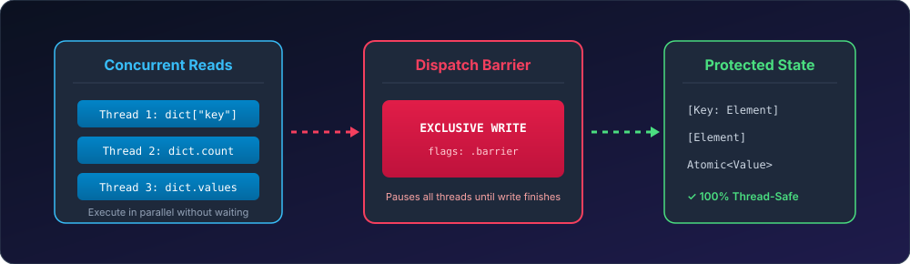

# ConcurrentCollections 🛡️

[](https://github.com/nilkanthdesai76/swift-concurrent-collections/actions)
High-performance, thread-safe collections (`ThreadSafeDictionary`, `ThreadSafeArray`, `@Atomic`) for Swift utilizing concurrent dispatch queues with write barriers.

[](https://swift.org)
[](https://developer.apple.com)
[](https://swift.org/package-manager/)
[](LICENSE)

<p align="center">
  
</p>

---

## 💡 The Architecture (Readers-Writer Lock)

Standard Swift `Array` and `Dictionary` types are not thread-safe. Accessing them from multiple threads concurrently leads to fatal `EXC_BAD_ACCESS` memory corruption crashes.

**ConcurrentCollections** implements the proven **Readers-Writer Lock pattern**:
1. **Reads** execute concurrently in parallel across multiple threads without locking bottlenecks (`queue.sync`).
2. **Writes** execute exclusively using a Dispatch Barrier (`queue.async(flags: .barrier)`), pausing reads just long enough to safely commit updates.

---

## 🚀 Installation

Add **ConcurrentCollections** via Swift Package Manager:

```swift
dependencies: [
    .package(url: "https://github.com/nilkanthdesai76/swift-concurrent-collections.git", from: "1.0.0")
]
```

---

## 💻 Quick Start

### 1. `ThreadSafeDictionary`

```swift
import ConcurrentCollections

let dict = ThreadSafeDictionary<String, Int>()

// Concurrent writes
dict["apples"] = 10
dict["oranges"] = 25

// Concurrent reads
let appleCount = dict["apples"] // Optional(10)
let allKeys = dict.keys
let allValues = dict.values

// Thread-safe filtering
let bulkItems = dict.filter { key, count in
    count > 15
}
```

### 2. `ThreadSafeArray`

```swift
import ConcurrentCollections

let array = ThreadSafeArray<String>()

// Safe append
array.append("First")
array.append("Second")

// Bounds-safe subscripting (returns nil instead of crashing if out-of-bounds!)
let item = array[0] // Optional("First")
let outOfBounds = array[99] // nil (safe!)

// Filter
let filtered = array.filter { $0.hasPrefix("F") }
```

### 3. `@Atomic` Property Wrapper

```swift
final class AppSessionManager {
    @Atomic var activeRequestCount: Int = 0

    func trackNewRequest() {
        $activeRequestCount.mutate { $0 += 1 }
    }
}
```

### 4. Multiple Equality Operator (`&&`)

```swift
// Validates if an optional element matches all elements in a target array
let target = 5
let values = [5, 5, 5]

if target && values {
    print("All values in array match target!")
}
```

---

## 🧪 Testing

Run test suite via Swift CLI:

```sh
swift test
```

---

## 📄 License

This project is licensed under the MIT License - see the [LICENSE](LICENSE) file for details.
